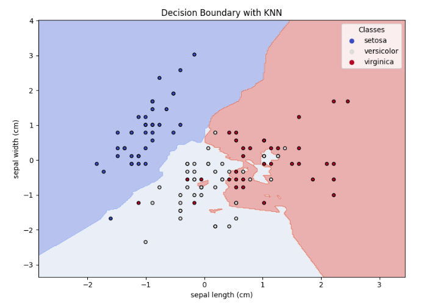
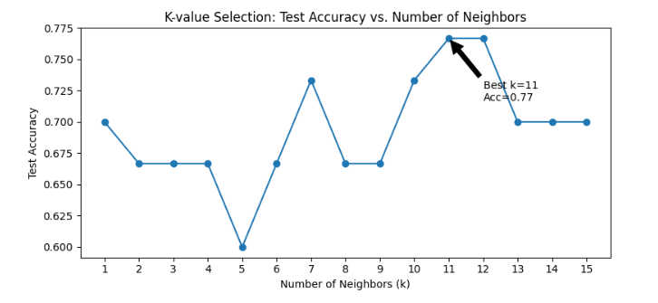

# K-Nearest Neighbors (KNN) Classification on Iris Dataset

[](https://www.python.org/)
[](https://scikit-learn.org/stable/)
[](https://seaborn.pydata.org/)
[](./LICENSE)
[](https://jupyter.org/)
[](https://www.kaggle.com/code/evangelosgakias/k-nearest-neighbors-iris-dataset)
[](https://www.kaggle.com/code/evangelosgakias/k-nearest-neighbors-iris-dataset)

---

## 🚀 Live Results
You can view the notebook with all outputs and results on Kaggle: [https://www.kaggle.com/code/evangelosgakias/k-nearest-neighbors-iris-dataset](https://www.kaggle.com/code/evangelosgakias/k-nearest-neighbors-iris-dataset)

All metrics, plots, and outputs are available in the linked Kaggle notebook for full transparency and reproducibility.

---

## 📑 Table of Contents
- [Live Results](#-live-results)
- [Table of Contents](#-table-of-contents)
- [Overview](#-overview)
- [Project Structure](#-project-structure)
- [Features](#-features)
- [Quickstart](#-quickstart)
- [Usage](#-usage)
- [Results](#-results)
- [Limitations and Future Work](#-limitations-and-future-work)
- [Contributing](#-contributing)
- [License](#-license)
- [Contact](#-contact)

---

## 📝 Overview
This project presents a comprehensive machine learning workflow for classifying iris species using the **K-Nearest Neighbors (KNN)** algorithm on the classic scikit-learn Iris dataset. The notebook demonstrates:
- End-to-end data science best practices (EDA, preprocessing, modeling, evaluation, and interpretation)
- Hyperparameter tuning and model analysis
- Professional documentation, accessibility, and reproducibility standards

**Goal:** Classify iris flowers into one of three species based on four physical features. This project is ideal for those seeking a clear, portfolio-ready example of classification analysis in classic datasets.

---

## 🏗️ Project Structure
```
K-Nearest Neighbors/
├── KNN.ipynb                  # Jupyter notebook with the complete implementation
├── README.md                  # Project documentation (this file)
├── requirements.txt           # Python dependencies
├── LICENSE                    # MIT License file
└── figure/                    # Folder containing result images
    ├── desicion_boundary.png  # Decision boundary plot
    └── k_value_selection.png  # Accuracy vs. k plot
```

---

## 🚀 Features
### Data Preparation
- **Dataset Loading:** Uses the scikit-learn Iris dataset (4 features, 3 classes)
- **Exploratory Data Analysis (EDA):** Statistical summaries, class distribution, and visualizations (pairplots, countplots)
- **Preprocessing:**
  - Feature scaling (StandardScaler)
  - Train/test split (80%/20%, stratified)

### Modeling
- **K-Nearest Neighbors Classifier:**
  - Scikit-learn implementation
  - Hyperparameter tuning (k, distance metric, weights) via GridSearchCV
- **Pipeline:** Combines scaling and modeling for reproducibility

### Evaluation & Interpretation
- **Metrics:** Accuracy, Precision, Recall, F1-score, Confusion Matrix
- **Cross-Validation:** 5-fold cross-validation for model stability
- **Baseline Comparison:** Majority class baseline
- **Visualization:**
  - Decision boundary plots (2D slice)
  - Accuracy vs. k-value plots

---

## ⚡ Quickstart
1. **Kaggle (Recommended for Reproducibility):**
   - [Run the notebook on Kaggle](https://www.kaggle.com/code/evangelosgakias/k-nearest-neighbors-iris-dataset)
2. **Local:**
   - Clone the repo and run `KNN.ipynb` in Jupyter after installing requirements.

---

## 💻 Usage
1. **📥 Clone the repository:**
   ```bash
   git clone https://github.com/EvanGks/knn-iris-classification.git
   cd knn-iris-classification
   ```
2. **🔒 Create and activate a virtual environment:**
   - **Windows:**
     ```bash
     python -m venv .venv
     .venv\Scripts\activate
     ```
   - **macOS/Linux:**
     ```bash
     python3 -m venv .venv
     source .venv/bin/activate
     ```
3. **📦 Install dependencies:**
   ```bash
   pip install -r requirements.txt
   ```
4. **🚀 Launch Jupyter Notebook:**
   ```bash
   jupyter notebook KNN.ipynb
   ```
5. **▶️ Run all cells** to reproduce the analysis and results.

**🛠️ Troubleshooting:**
- If you encounter missing package errors, ensure your Python environment is activated and up to date.

---

## 📊 Results
### Model Metrics

| Accuracy   | Precision  | Recall     | F1 Score   |
|-----------|------------|------------|------------|
| 0.933333  | 0.944444   | 0.933333   | 0.93266    |

**Classification Report:**
```
              precision    recall  f1-score   support

           0       1.00      1.00      1.00        10
           1       0.83      1.00      0.91        10
           2       1.00      0.80      0.89        10

    accuracy                           0.93        30
   macro avg       0.94      0.93      0.93        30
weighted avg       0.94      0.93      0.93        30
```

**Best parameters found:**
```
{'metric': 'euclidean', 'n_neighbors': 5, 'weights': 'uniform'}
```
**Best cross-validation accuracy:** 0.9666666666666668

**Test set accuracy of best model:** 0.93

**Classification report for best model:**
```
              precision    recall  f1-score   support

      setosa       1.00      1.00      1.00        10
  versicolor       0.83      1.00      0.91        10
   virginica       1.00      0.80      0.89        10

    accuracy                           0.93        30
   macro avg       0.94      0.93      0.93        30
weighted avg       0.94      0.93      0.93        30
```

### Visualizations
- **Decision Boundary Plot:**
  
- **Accuracy vs. k Plot:**
  

---

## 📝 Limitations and Future Work
- **Sensitivity to Feature Scaling:** KNN performance depends on proper scaling
- **Computational Cost:** Not ideal for very large datasets
- **Potential Improvements:**
  - Apply dimensionality reduction (e.g., PCA)
  - Test on larger or more complex datasets
  - Compare with other classifiers (e.g., Logistic Regression, Decision Trees)
  - Explore advanced hyperparameter tuning and cross-validation

---

## 🤝 Contributing
Contributions are welcome! Please feel free to submit a Pull Request. For major changes, please open an issue first to discuss what you would like to change.

---

## 📝 License
This project is licensed under the MIT License. See the [LICENSE](./LICENSE) file for details.

---

## 📬 Contact
For questions or feedback, please reach out via:
- **GitHub:** [EvanGks](https://github.com/EvanGks)
- **X (Twitter):** [@Evan6471133782](https://x.com/Evan6471133782)
- **LinkedIn:** [Evangelos Gakias](https://www.linkedin.com/in/evangelos-gakias-346a9072)
- **Kaggle:** [evangelosgakias](https://www.kaggle.com/evangelosgakias)
- **Email:** [evangks88@gmail.com](mailto:evangks88@gmail.com)
---

Happy Coding! 🚀
